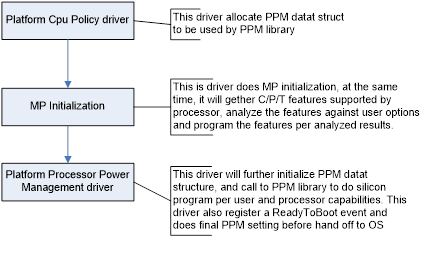
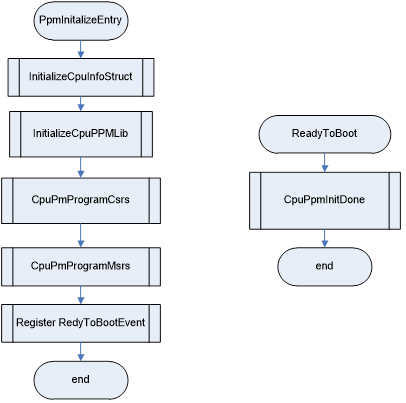

# Purley CPU Power Management Reference Code

# User&#39;s Guide

**_Dec. 2014_**

**_Revision 0.5_**

**Intel Confidential**

- - -

## Contents

[TOC]

- - -

## Revision History

Rev. No. | Description      					             | Date
---------|-----------------------------------------|--------
0.4      | Initial revision 					             | Apr 2014
0.5      | Code complete version before Si Tape-in | Dec 2014

- - -

## Legal Notice

**Notice: This document contains information on products in the design phase
of development. The information here is subject to change without notice.
Do not finalize a design with thin information.**

Intel technologies&#39; features and benefits depend on system configuration
and may require enabled hardware, software, or service activation. Learn more
at intel.com, or from the OEM or retailer. No computer system can be absolutely
secure. Intel does not assume any liability for lost or stolen data or systems
or any damages resulting from such losses.

You may not use or facilitate the use of this document in connection with any
infringement or other legal analysis concerning Intel products described herein.
You agree to grant Intel a non-exclusive, royalty-free license to any patent
claim thereafter drafted which includes subject matter disclosed herein.

No license (express or implied, by estoppel or otherwise) to any intellectual
property rights is granted by this document.

The products described may contain design defects or errors known as errata
which may cause the product to deviate from published specifications. Current
characterized errata are available on request.

This document contains information on products, services and/or processes in
development. All information provided here is subject to change without notice.
Contact your Intel representative to obtain the latest Intel product specifications
and roadmaps.

Intel disclaims all express and implied warranties, including without limitation,
the implied warranties of merchantability, fitness for a particular purpose, and
non-infringement, as well as any warranty arising from course of performance, course
of dealing, or usage in trade.

Copies of documents which have an order number and are referenced in this document
may be obtained by calling 1-800-548-4725 or by visiting
[www.intel.com/design/literature.htm](http://www.intel.com/design/literature.htm).

Intel, the Intel logo, and Xeon are trademarks of Intel Corporation in the U.S. 
and/or other countries.

*Other names and brands may be claimed as the property of others.

_Copyright &copy; 2015, Intel Corporation. All Rights Reserved._

- - -

## Introduction

This document accompanies the CPU Power Management Sample Code. The primary purpose of this document is to describe the contents of the Power Management Sample code. In addition this document describes the integration methods for Independent BIOS Vendors (IBVs) and Intel OEM customers.

### CPU PM Sample Code package contents

The CPU PM Sample code package is a collection of modules that gives OEM a reference on how the CPU PM Sample code is arranged. This also gives an idea on what is specific functionality of modules and files are required for supporting Power management features.

This code is used directly in Intel validation and CRB BIOS, and it is expected to be compatible with all platforms that follow the Platform Design Guide. The code is platform and codebase dependent and is not expected to be compatible with all platforms and customer codebase.

- - -

## Platform Drivers

### Power Management Driver

**PpmInitialize.c** Entry point for Platform Power Management driver

This driver is responsible for programming the Power Management features of CPU. The Power management features and the data that need to be programmed are collected, analyzed and initialized in Platform Cpu policy driver and CPUMPDxe driver. Power manager driver call to PPM Lib per processor PPM featured supported.

### Platform Cpu Policy Driver

**PlatformCpuPolic.c** Entry point for platform cpu policy

This driver will allocate memory for EFI\_PPM\_STATRUCT and initialize it per platform specific PPM configuration requirement, for example initialized and passing user PPM options etc. The PPM driver will pass this data struct to PPM library for silicon program.

### Cpu MP DXE Driver

The CpuMpDxe Driver follows a three phase method to collect data and program the features into its registers.

* Data Collection Phase: In this Phase the CPU feature Capability is determined.
* Data Analysis Phase: In this Phase the user input data from setup options to program the feature is collected and  analyzed based on the feature support in the processor.
* Setting Phase: The data to be programmed is added to a register table and then programmed into registers. The register table address will be dumped into memory, to be used for S3Resume. The setting Phase is skipped for the Power Management features. Instead a callback event is created for the PPM driver

All legacies P/C/T feature programming is done in this driver.

- - -

## Processor Power Management Library

This library provides advanced processor power mange program functionality. This driver takes PPM feature configuration input from EFI\_PPM\_STRUCT and programs each PPM features per caller request.

### PPM Data Structure

~~~~{.c}
typedef struct {
  PPM_VERSION                   Version;
  EFI_CPU_CSR_ACCESS_PROTOCOL   *CpuCsrAccess;
  PPM_FROM_PPMINFO_HOB          *Info;
  EFI_PPM_STRUCT                *Setup;
  UINTN                         ProcessorNumber;
} EFI_CPU_PM_STRUCT;

typedef struct {
  UINT8           ConfigTDP;
  UINT8           PcpsCtrl;
  UINT8           FastRaplDutyCycle;
  UINT8           FuseTjMaxOffset;
  UINT8           OverclockingLock;
  UINT32          AdvPwrMgtCtlFlags;
  MSR_REGISTER    PowerCtl;
  MSR_REGISTER    TurboPowerLimit;
  MSR_REGISTER    PP0CurrentCfg;
  MSR_REGISTER    PerfBiasConfig;
  UINT32          ProchotRatio;
  UINT32          PmaxConfig;
  UINT32          SapmCtl;
  UINT32          PerPLimitCtl;
  UINT32          C2C3TT;
  UINT32          DynamicPerPowerCtl;
  UINT32          PcieIltrOvrd;
  CSTATE_STRUCT   Cst;
  PSTATE_STRUCT   Pst;
  XE_STRUCT       Xe;
  HWPM_STRUCT     Hwpm;
  TURBO_RATIO_LIMIT_RATIO_CORES TurboRatioLimitRatioCores;
  UINT8           TCCActivationOffset;
  DTS_STRUCT      Dts;
} EFI_PPM_STRUCT;

typedef struct {
  UINT8           Major;                   // Major Vesion
  UINT8           Minor;                   // Minor Vesion
  UINT8           Rev;                     // Release Version
  UINT8           Build;                   //
} PPM_VERSION;

typedef union _MSR_REGISTER {
    UINT64  Qword;
    struct _DWORDS {
        UINT32  Low;
        UINT32  High;
    } Dwords;
    struct _BYTES {
        UINT8 FirstByte;
        UINT8 SecondByte;
        UINT8 ThirdByte;
        UINT8 FouthByte;
        UINT8 FifthByte;
        UINT8 SixthByte;
        UINT8 SeventhByte;
        UINT8 EighthByte;
    } Bytes;
} MSR_REGISTER;

typedef struct {
  BOOLEAN   C1e;
  UINT32          PkgCstEntryCriteriaMaskKti;
  UINT32          PkgCstEntryCriteriaMaskPcie;
  MSR_REGISTER    LatencyCtrl[NUM_CST_LAT_MSR];
 } CSTATE_STRUCT;

typedef struct {
  BOOLEAN     EistEnabled;            // option to enable GV3
} PSTATE_STRUCT;

typedef struct {
  BOOLEAN   Enable;
  UINT32    Voltage;
  UINT16    RatioLimit[MAX_CORE];
} XE_STRUCT;
~~~~

### PPM Library functions

SKX BIOS PPM library provide following silicon program functions. Refer to 4.1 for more information.

~~~~{.c}
VOID PStateTransition (  EFI_CPU_PM_STRUCT   *ppm  );
VOID InitializeCpuPPMLib ( EFI_CPU_PM_STRUCT   *ppm );
VOID PpmSetBiosInitDone ( EFI_CPU_PM_STRUCT   *ppm );
VOID PpmSetCsrLockBit ( EFI_CPU_PM_STRUCT   *ppm );
VOID PpmSetTurboLimitPcuSemaphore ( EFI_CPU_PM_STRUCT   *ppm );
VOID PpmSetMsrLockBit ( EFI_CPU_PM_STRUCT   *ppm );
VOID ProgramCsrPcuBiosSpare2 ( EFI_CPU_PM_STRUCT   *ppm  );
VOID ProgramCSRTurboPowerLimit (	EFI_CPU_PM_STRUCT *ppm );
VOID ProgramCsrDynamicPerfPowerCtl (  EFI_CPU_PM_STRUCT   *ppm  );
VOID ProgramCsrSapmCtl (  EFI_CPU_PM_STRUCT   *ppm );
VOID ProgramCsrSwLtrOvrd (  EFI_CPU_PM_STRUCT   *ppm );
VOID ProgramCsrPkgCstEntryCriteriaMask(  EFI_CPU_PM_STRUCT   *ppm );
VOID ProgramCsrResponseRatioCfg (  EFI_CPU_PM_STRUCT   *ppm );
VOID EFIAPI SetupPCIEPkgCstEntryCriteria (  EFI_CPU_PM_STRUCT   *ppm  );
VOID ProgramCsrPerfPlimitControl (	EFI_CPU_PM_STRUCT   *ppm );
VOID ProgramCsrPmaxConfig (  EFI_CPU_PM_STRUCT   *ppm );
VOID ProgramMsrPowerCtl (  EFI_CPU_PM_STRUCT   *ppm );
VOID ProgramMsrTurboPowerLimit (EFI_CPU_PM_STRUCT *ppm );
VOID ProgramEnergyPerfBiasConfigMsr (  EFI_CPU_PM_STRUCT   *ppm  );
VOID ProgMsrPriPlaneCurtCfgCtrL (  EFI_CPU_PM_STRUCT   *ppm  );
VOID ProgramMsrTurboRatioLimit ( EFI_CPU_PM_STRUCT *ppm  );
VOID ProgramMsrTemperatureTarget (  EFI_CPU_PM_STRUCT *ppm );
VOID GetMsrTemperatureTarget (  EFI_CPU_PM_STRUCT *ppm );
VOID ProgramMsrMiscPwrMgmt ( EFI_CPU_PM_STRUCT *ppm );
VOID Program_Bios_Reset_Cpl (  EFI_CPU_PM_STRUCT *ppm  );
VOID ProgramB2PFastRaplDutyCycle (  EFI_CPU_PM_STRUCT *ppm  );
UINT8 EFIAPI GetHwpmSupport (  EFI_CPU_PM_STRUCT *ppm );
VOID HWPMInterfaceReg (  EFI_CPU_PM_STRUCT *ppm );
VOID EnableAutonomousCStateControl (  EFI_CPU_PM_STRUCT *ppm );
VOID EFIAPI EnableHwpLvtThermalInterrupt (  EFI_CPU_PM_STRUCT *ppm );
VOID EFIAPI EnableHwpFeatures (  EFI_CPU_PM_STRUCT *ppm );
VOID ProgramB2PPcuMiscConfig  (  EFI_CPU_PM_STRUCT *ppm );
VOID ProgramB2PHWPMMiscConfig  (  EFI_CPU_PM_STRUCT *ppm );
VOID ProgramCsrPcuDtsConfig  (  EFI_CPU_PM_STRUCT *ppm );
VOID ProgramMsrCLatecncy  (  EFI_CPU_PM_STRUCT *ppm );
~~~~

- - -

## Power Management Feature Program

This chapter describes the detailed CPU PPM feature programming. Figure 4-1 and 4-2 below gives a high level program flow.

### Figure PPM High Level Flow

### Figure PPM Dxe Driver High Level Flow

### Processor Power Management DXE Driver

This driver initializes the data structures needed by this driver and PPM library.

* `PpmInitializeEntry()`  Entry point of PPM DXE driver.

* `InitializeCpuInfoStruct()`  initialize PPM\_FROM\_PPMINFO\_HOB data struct that needed for this driver

* `InitlaizeCpuPpmLib()`  initialized info data portion in EFI\_CPU\_PM\_STRCUT gather from DXE Hub

* `CpuPpmProgramCsrs()`  called to PPM library to program following CSR PPM features:

    * ProgramCSRTurboPowerLimit
  
    * ProgramCsrPkgCstEntryCriteriaMask
  
    * ProgramCsrPerfPlimitControl
  
    * ProgramCsrDynamicPerfPowerCtl
  
    * ProgramCsrSapmCtl
  
    * ProgramCsrSwLtrOvrd
  
    * ProgramCsrPmaxConfig
  
    * SetupPCIEPkgCstEntryCriteria
  
    * ProgramCsrResponseRatioCfg
  
    * ProgramB2PFastRaplDutyCycle
  
    * ProgramB2PPcuMiscConfig
  
    * ProgramCsrPcuDtsConfig
  
    * ProgramB2PHWPMMiscConfig

* `CpuPpmProgramMsrs()`  called to PPM library to program following MSR PPM features:

    * ProgramMsrPowerCtl

    * ProgMsrPriPlaneCurtCfgCtrL

    * ProgramMsrTurboPowerLimit

    * ProgramMsrTurboRatioLimit

    * ProgramEnergyPerfBiasConfigMsr

    * ProgramMsrTemperatureTarget

    * ProgramMsrMiscPwrMgmt
    
    * ProgramMsrCLatecncy
  
    * EnableHwpFeatures
  
    * EnableAutonomousCStateControl

* `PpmOnReadyToBoot()`  PPM DXE driver will register this callback function at end of the driver, and the function will be triggered beforehand off to the OS, this function will do final PPM program.

    * PpmSetTurboLimitPcuSemaphore

    * PpmSetMsrLockBit

    * PpmSetCsrLockBit

    * PpmSetBiosInitDone

### Processor Power Management Library

This library provides advanced processor power management functionalities through CSRs or MSRs. Following section describe them. Each function takes PPM Data struct pointer which already initialized through platform PPM capability or user options.

#### CSR based Power management

* **CsrDynamicPerfPowerCtl.c**  This file contains the routine is called to program CSR DYNAMIC\_PERF\_POWER\_CTL for detected socket.
    * ProgramCsrDynamicPerfPowerCtl: Programs CSR DYNAMIC\_PERF\_POWER\_CTL for detected socket based on SETUP options.

* **CsrPerfPLimit.c**  This file contains the routine is called to program CSR PERF\_P\_LIMIT\_CONTROL for detected socket.
    * ProgramCsrPerfPlimitControl: Programs CSR\_PERF\_P\_LIMIT\_CONTROL for detected socket based on SETUP options.

* **CsrPkgCstEntryCriteriaMask.c**  This file contains the routine is called to program CST\_ENTRY\_CRITERIA\_MASK\_CFG\_PCU\_FUN2 and CST\_ENTRY\_CRITERIA\_MASK\_CFG2\_PCU\_FUN2 for detected socket.
    * ProgramCsrPkgCstEntryCriteriaMask: Programs CST\_ENTRY\_CRITERIA\_MASK\_CFG2\_PCU\_FUN2 for detected socket based on SETUP options for KTIs.
    * SetupPCIEPkgCstEntryCriteria: Programs CST\_ENTRY\_CRITERIA\_MASK\_PCU\_FUN2 for detected socket based on SETUP options for PCIe links.

* **CsrSapmCtl.c**  This file contains the routine is called to program CSR SAPMCTL for detected socket.
    * ProgramCsrSapmCtl: Programs CSR\_SAPMCTL for detected socket based on SETUP options.

* **CsrSwLtrOvrd.c**  This file contains the routine is called to program CSR\_PCIE\_ILTR\_OVRD for detected socket.
    * ProgramCsrSwLtrOvrd: Programs CSR\_PCIE\_ILTR\_OVRD for detected socket based on SETUP options.

* **CsrTurboPowerLimit.c**  This file contains the routine is called to program CSR\_ PACKAGE\_RAPL\_LIMIT for detected socket.
    * ProgramCSRTurboPowerLimit: Programs C2C3TT\_CFG and CSR\_PACKAGE\_RAPL\_LIMIT for detected socket based on SETUP options.
    * ProgramB2PFastRaplDutyCycle: Programs B2P Command FAST\_RAPL\_DUTY\_CYCLE (0x9D) for detected socket based on SETUP   options.

* **CpuPpmLib.c**  This file contains the routines that initialize the PPM Lib, Ppm done and other generic library calls as below.
    * InitializeCpuPPMLib: intilaize EFI\_CPU\_PM\_STRCUT
    * PStateTransition: transit to P1 per SETUP option
    * PpmSetBiosInitDone: will set BIOS\_RESET\_CPL bit3 and 4
    * PpmSetCsrLockBit: will lock following CSRs  PACKAGE\_RAPL\_LIMIT , SAPMCTL, DRAM\_PLANE\_POWER\_LIMIT, P\_STATE\_LIMITS , DESIRED\_CORE
    * PpmSetMsrLock: will lock following MSRs  TURBO\_POWER\_LIMIT, POWER\_CTL, PRIMARY\_PLANE\_TURBO\_LIMIT, and based on option, PMG\_CST\_CONFIG\_CONTROL, and FLEX\_RATIO if Overclocking capable is detected.

* **CsrPcuDtsConfig.c**  This routine is called to program DTS\_CONFIG1\_PCU\_FUN2\_REG and DTS\_CONFIG2\_PCU\_FUN2\_REG. It will be call multiple times passing any the SocketNumber to be programmed.
    * ProgramCsrPcuDtsConfig: Programs DTS\_CONFIG1\_PCU\_FUN2\_REG and DTS\_CONFIG2\_PCU\_FUN2\_REG for detected socket based on SETUP options.

* **CsrPmaxConfig.c**  This routine is called to program PERF\_P\_LIMIT\_CONTROL. It will be call multiple times passing any the SocketNumber to be programmed.
    * ProgramCsrPmaxConfig: Programs PERF\_P\_LIMIT\_CONTROL for detected socket based on SETUP options.

* **CsrResponseRatioCfg.c**  This routine is called to program PROCHOT\_RESPONSE\_RATIO\_CFG. It will be call multiple time passing any the SocketNumber to be programmed.
    * ProgramCsrSwLtrOvrd: PROCHOT\_RESPONSE\_RATIO\_CFG for detected socket based on SETUP options.

#### MSR based Power management

* **MsrEnergyPerfBias.c**  This file contains the routine is called to program MSR ENERGY\_PERF\_BIAS\_CONFIG.
    * ProgramEnergyPerfBiasConfigMsr: Program MSR\_ENERGY\_PERF\_BIAS\_CONFIG for specified processor.

* **MsrPowerCtl.c**  This file contains the routine is called to program MSR POWER\_CTL.
    * ProgramMsrPowerCtl: Program MSR\_POWER\_CTL for specified processor.

* **MsrPriPlaneCurtCfgCtrL.c**  This file contains the routine is called to program MSR PRIMARY\_PLANE\_CURRENT\_CONFIG\_CONTROL.
    * ProgMsrPriPlaneCurtCfgCtrL: Program MSR\_PRIMARY\_PLANE\_CURRENT\_CONFIG\_CONTROL for specified processor.

* **MsrTurboPowerLimit.c**  This file contains the routine is called to program MSR TURBO\_POWER\_LIMIT.
    * ProgramMsrTurboPowerLimit: Program MSR\_ TURBO\_POWER\_LIMIT for specified processor.

* **MsrTurboRatioLimit.c**  This file contains the routine is called to program MSR EFI\_MSR\_TURBO\_RATIO\_LIMIT\_RATIOS and EFI\_MSR\_TURBO\_RATIO\_LIMIT\_CORES.
    * RatioLimitCheck: This function check the user RatioLimit option inputs.
    * ProgramMsrTurboPowerLimit: Program EFI\_MSR\_TURBO\_RATIO\_LIMIT\_RATIOS and EFI\_MSR\_TURBO\_RATIO\_LIMIT\_CORES for specified processor.
    * PpmSetTurboLimitPcuSemaphore: Set the semaphore after programming the ratio limit MSR.

* **MsrTemperatureTarget.c**  This file contains the routine is called to program MSR MSR\_TEMPERATURE\_TARGET.
    * GetMsrTemperatureTarget: This routine is called to get MSR\_TEMPERATURE\_TARGET value. It will be call multiple time   passing any the node to be programmed.
    * ProgramMsrTemperatureTarget: Program MSR\_TEMPERATURE\_TARGET for specified processor.

* **CpuHWPMConfig.c**  This file contains the routines to check/program HWPM related MSR MSR\_MISC\_PWR\_MGMT, MSR\_PMG\_CST\_CONFIG\_CONTROL, MSR\_IA32\_HWP\_INTERRUPT, EFI\_EXT\_XAPIC\_LVT\_THERM, and B2P MAILBOX\_BIOS\_CMD\_WRITE\_PCU\_MISC\_CONFIG.
    * GetHwpmSupport: Checks FUSE\_HWP\_ENABLE support for HWPM feature for specified processor.
    * HWPMInterfaceReg: Enables HWPM Interface feature for specified processor.
    * EnableAutonomousCStateControl: Enables Autonomous Cstate feature for specified processor.
    * EnableHwpLvtThermalInterrupt: Enables the Thermal Interrupt in the core Local APIC.
    * EnableHwpFeatures: This function check and enable the HWP features.
    * ProgramB2PHWPMMiscConfig: This routine is called to program PCU\_MISC\_CONFIG bits - PCU\_MISC\_CONFIG\_APS\_ROCKETING, PCU\_MISC\_CONFIG\_SCALABILITY, and PCU\_MISC\_CONFIG\_PPO\_BUDGET.

* **MsrCLatencyCtl.c**  This file contains the routine is called to program C-State Latency MSRs.
    * ProgramMsrCLatecncy: Program MSR\_C\_STATE\_LATENCY\_CONTROL\_x (x=0-2) for specified processor.

* **PCPS.c**  This file contains the routines to program PCU\_MISC\_CONFIG and to program MSR\_MISC\_PWR\_MGMT.
    * ProgramB2PPcuMiscConfig: Program B2P PCU\_MISC\_CONFIG bit PCU\_MISC\_CONFIG\_SPD\_ENABLE based on SETUP option.
    * ProgramMsrMiscPwrMgmt: This routine is called to program MSR\_MISC\_PWR\_MGMT based on SETUP option.

### Legacy C/P/T Feature Program

Following legacy C-State, P-State and T-State feature program are done during MP initialization.

#### C1e

* **C1e.c**  This legacy feature and it is support in CPU MP DXE driver, it will check capability of C1E feature on processor, then program C1E according SETUP option settings.
    * C1eDetect: Detect capability of C1E feature for specified processor.
    * C1eConfigFeatureList: Configures Processor Feature Lists for C1E feature for all processors.
    * C1eReg: Produces entry of C1E feature in Register Table for specified processor.

* **C1e.h**  Defines for C1e.c.

#### Cpu Misc Features

* **Misc.c**  This file contains legacy CPU features and also supported by CPU MP DXE driver and features will be programmed during MP initialization. Feature detection for MWAIT, 3StrikeCounter, EnergyPerformanceBias, and APIC TPR Update Message, then program feature according SETUP option settings passed through EDK2 Pcds.
    * MonitorMwaitDetect: Detect capability of MONITOR/MWAIT instructions for specified processor.
    * MonitorMwaitConfigFeatureList: Configures Processor Feature Lists for MONITOR/MWAIT instructions for all processors.
    * MonitorMwaitReg: Produces entry of MONITOR/MWAIT feature in Register Table for specified processor.
    * ThreeStrikeCounterDetect: Detect capability of Three Strike Counter for specified processor.
    * ThreeStrikeCounterConfigFeatureList: Configures Processor Feature Lists for Three Strike Counter Prefetch for all processors.
    * ThreeStrikeCounterReg: Produces entry of Three Strike Counter in Register Table for specified processor.
    * EnergyPerformanceBiasDetect: Detect capability of Energy Performance Bias for specified processor.
    * EnergyPerformanceBiasConfigFeatureList: Configures Processor Feature Lists for Energy Performance Bias for all processors.
    * EnergyPerformanceBiasReg: Produces entry of Energy Performance Bias in Register Table for specified processor.
    * ApicTprUpdateMessageDetect:: Detect capability of APIC TPR Update Message for specified processor.
    * ApicTprUpdateMessageConfigFeatureList: Configures Processor Feature Lists for APIC TPR Update Message for all processors.
    * ApicTprUpdateMessageReg: Produces entry of APIC TPR Update Message feature in Register Table for specified processor.

* **Misc.h**  Defines for CpuMiscFeatures.c.

#### CState

* **CState.c**  This driver will check capability of C-State feature on processor, then program C-State according SETUP option settings.
    * CStateDetect: Detect capability of C-State for specified processor.
    * CStateConfigFeatureList: Configures Processor Feature Lists for C-State for all processors.
    * CStateReg: Produces entry of C-State feature in Register Table for specified processor.

* **CState.h**  Defines for CState.c.

#### Eist/ControlTPD

* **Eist.c**  This driver will check capability of EIST feature on processor, then program EIST according SETUP option settings.
    * EistDetect: Detect capability of EIST feature for specified processor.
    * CalculateFvidTable: Calculate the FVID table for all logical processors based on their CPU ID.
    * EistConfigFeatureList: Configures Processor Feature Lists for EIST feature for all processors.
    * EistReg: Produces entry of EIST feature in Register Table for specified processor.

* **Eist.h**  Defines for Eist.c.

#### Thermal Management

* **ThermalManagement.c**  This driver will check capability of Thermal Management feature on processor, then program Thermal Management according SETUP option settings.
    * ThermalManagementDetect: Detect capability of Thermal Management feature for specified processor.
    * ThermalManagementConfigFeatureList: Configures Processor Feature Lists for Thermal Management feature for all processors.
    * ThermalManagementReg: Produces entry of Thermal Management feature in Register Table for specified processor.

* **ThermalManagement.h**  Defines for ThermalManagement.c.

#### Throttling States

* **TState.c**  This driver will check capability of T-State feature on processor, then program T-State according to SETUP option settings.
    * TStateDetect: Detect capability of T-State feature for specified processor.
    * TStateConfigFeatureList: Configures Processor Feature Lists for T-State feature for all processors.
    * TStateReg: Produces entry of T-State feature in Register Table for specified processor.

* **TState.h**  Defines for TState.c.

### CSR Access

CSR access are provided through CpuCsrAccess driver, a pointer to EFI\_CPU\_CSR\_ACCESS\_PROTOCOL will included in EFI\_CPU\_PPM\_STRUCT.
The protocol provides following functons:

* `ReadCpuCsr()`
* `WriteCpuCsr()`
* `Bios2PcodeMailBoxWrite()`